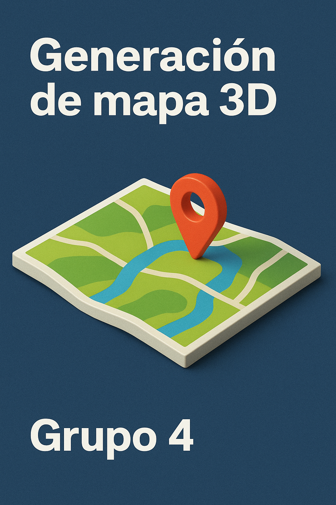

# 🗻 Generación de Mapa 3D — Ecuador

<div align="center">
  
</div>

---
## Objetivo 

Generar modelos de relieve topográfico 3D imprimibles a partir de datos de elevación SRTM de Ecuador continental. El resultado es un archivo **STL** listo para impresión en cualquier slicer como Bambu Studio.

---
 
**INTEGRANTES**

Christopher Criollo

Alegria Farinango

Sebastian Oña 

Lenin Vásquez

---

##  Tabla de contenidos

- [🗻 Generación de Mapa 3D — Ecuador](#-generación-de-mapa-3d--ecuador)
  - [Objetivo](#objetivo)
  - [Tabla de contenidos](#tabla-de-contenidos)
  - [Descripción](#descripción)
  - [Requisitos](#requisitos)
  - [Instalación](#instalación)
  - [Estructura del proyecto](#estructura-del-proyecto)
  - [Datos de entrada](#datos-de-entrada)
  - [Flujo de trabajo](#flujo-de-trabajo)
  - [Uso de los scripts](#uso-de-los-scripts)
  - [Uso de la GUI](#uso-de-la-gui)
  - [Parámetros de exportación STL](#parámetros-de-exportación-stl)
  - [Notas técnicas](#notas-técnicas)
  - [Dependencias](#dependencias)

---

## Descripción

Esta herramienta lee tiles de elevación en formato **HGT** (SRTM 3 arc-second), los une en un DEM georreferenciado de todo Ecuador continental, y permite seleccionar cualquier zona visualmente desde una GUI interactiva para exportarla como modelo 3D STL. El modelo genera un sólido cerrado (manifold) con superficie topográfica, base plana y paredes laterales, optimizado para impresión directa sin reparación previa.

---

## Requisitos

- **Python 3.10+**
- Sistema operativo: Windows
- Para `rasterio`: se requiere tener **GDAL** instalado en el sistema (en Windows se recomienda usar las wheels binarias de rasterio o instalar con conda)
- Datos HGT de las zonas de Ecuador (ver sección [Datos de entrada](#datos-de-entrada))

---

## Instalación

```bash
# 1. Clonar el repositorio
git clone <URL_del_repo>
cd Mapa

# 2. Crear y activar entorno virtual
python -m venv venv

# Windows
venv\Scripts\activate

# macOS / Linux
source venv/bin/activate

# 3. Instalar dependencias
pip install -r requirements.txt
```

---

## Estructura del proyecto

```
Mapa/
├── main.py                              # Script de visualización rápida del DEM
├── requirements.txt                     # Dependencias de Python
├── gitignore.txt                        # Reglas de .gitignore
│
├── scripts/                             # Scripts de pre-procesamiento (se ejecutan una vez)
│   ├── build_all_zones.py               # Convierte tiles HGT → GeoTIFF por zona
│   ├── build_ecuador_full.py            # Une los 6 TIFFs zonales en un DEM nacional
│   ├── build_ecuador_display.py         # Genera versión reducida (1/8) para la GUI
│   └── build_ecuador_clip.py            # Recorta el DEM al contorno de Ecuador
│
├── src/
│   ├── core/                            # Lógica central del pipeline
│   │   ├── pipeline.py                  # Pipeline: lectura → procesamiento → STL
│   │   ├── stl_exporter.py              # Exportación de grilla a STL ASCII
│   │   ├── terrain_ops.py               # Operaciones básicas sobre matrices de elevación
│   │   └── zone_builder.py              # Mosaico de tiles HGT en GeoTIFF por zona
│   │
│   ├── io/                              # Entrada/salida de datos geoespaciales
│   │   ├── hgt_loader.py                # Lectura de archivos binarios HGT (SRTM)
│   │   ├── tif_loader.py                # Lectura y estadísticas de GeoTIFF
│   │   ├── display.py                   # Visualización básica con matplotlib
│   │   ├── geojson_utils.py             # Utilidades para geometrías GeoJSON
│   │   ├── masker.py                    # Enmascarado de rasters con geometría Ecuador
│   │   └── window_utils.py              # Conversión de bbox lon/lat a Window de rasterio
│   │
│   ├── math/                            # Algoritmos numéricos (sin dependencias externas)
│   │   ├── fill.py                      # Relleno iterativo de NaN por promedio de vecinos
│   │   ├── filters.py                   # Filtro Gaussiano 2D separable
│   │   └── scaling.py                   # Escala lineal de metros a milímetros
│   │
│   ├── processing/                      # Procesamiento de rasters y mallas
│   │   ├── mesh_exporter.py             # Clase STLExporter: grilla → triángulos → STL
│   │   └── raster_cropper.py            # Recorte de rasters por bbox con downsample
│   │
│   └── ui/                              # Interfaz gráfica (customtkinter + matplotlib)
│       ├── app_gui.py                   # Ventana principal: visor de mapa y exportador STL
│       ├── layers.py                    # Gestor de capas (borde Ecuador, cantones)
│       ├── dialogs.py                   # Diálogo modal de parámetros de exportación (con validación)
│       ├── selection_tools.py           # Controlador de selección rectangular
│       ├── controllers/
│       │   └── selection_controller.py  # Selección de bounding box con RectangleSelector
│       ├── dialogs/
│       │   └── bbox_dialog.py           # Diálogo para ingreso manual de coordenadas
│       ├── widgets/
│       │   └── map_toolbar.py           # Barra de herramientas personalizada
│       └── data/
│           └── ecuador.geojson          # Contorno geográfico de Ecuador
│
├── data/                                # Datos de entrada (tiles HGT organizados por zona)
│   ├── A17/                             # Zona Norte (tiles N00, N01…)
│   ├── A18/
│   ├── SA17/                            # Zona Sur (tiles S01, S02…)
│   ├── SA18/
│   ├── SB17/
│   └── SB18/
│
└── outputs/
    └── dem/                             # GeoTIFFs generados por los scripts
        ├── <zona>_full.tif              # DEM por zona (ej: A17_full.tif)
        ├── ecuador_full.tif             # DEM unificado nacional
        ├── ecuador_display.tif          # Versión reducida para la GUI
        └── ecuador_display_clipped.tif  # DEM recortado al contorno nacional
```

---

## Datos de entrada

El proyecto necesita tiles de elevación SRTM en formato **HGT** (3 arc-second, resolución de 1201×1201 puntos por tile). Estos se obtienen de fuentes públicas como [SRTM data](http://www.viewfinderpanoramas.org/dem3.html) o [OpenTopography](https://opentopography.org).

Los tiles deben organizarse en carpetas dentro de `data/` según la zona geográfica que cubren:

| Carpeta | Zona que cubre |
|---------|---------------|
| `A17`   | Norte, longitud 17°W |
| `A18`   | Norte, longitud 18°W |
| `SA17`  | Sur A, longitud 17°W |
| `SA18`  | Sur A, longitud 18°W |
| `SB17`  | Sur B, longitud 17°W |
| `SB18`  | Sur B, longitud 18°W |

El nombre de cada archivo debe seguir el estándar SRTM, por ejemplo: `S01W079.hgt`, `N00W078.hgt`, etc.

---

## Flujo de trabajo

El proyecto sigue un pipeline de 4 etapas secuenciales:

```
┌─────────────────┐     ┌──────────────────┐     ┌─────────────────────┐     ┌──────────────┐
│  Tiles HGT      │────▶│  GeoTIFFs por    │────▶│  DEM nacional       │────▶│  DEM display │
│  (por zona)     │     │  zona            │     │  (ecuador_full.tif) │     │  + clip      │
└─────────────────┘     └──────────────────┘     └─────────────────────┘     └──────┬───────┘
  data/A17/*.hgt          outputs/dem/              merge de 6 zonas               1/8 resolución
  data/SA17/*.hgt         A17_full.tif              + compresión LZW              + contorno ECU
  ...                     SA17_full.tif
                          ...

                                                                               ┌──────▼───────┐
                                                                               │  GUI         │
                                                                               │  Visor +     │
                                                                               │  Export STL  │
                                                                               └──────────────┘
                                                                                Selección visual
                                                                                → modelo 3D imprimible
```

1. **Zonas HGT → GeoTIFF:** Cada carpeta de `data/` se convierte en un TIF georreferenciado.
2. **Unión nacional:** Los 6 TIFFs se unen en un solo DEM completo.
3. **Preparación para GUI:** Se genera una versión reducida con pirámides, y se recorta al contorno de Ecuador (sin Galápagos).
4. **Exportación STL:** La GUI permite seleccionar una zona y exportarla como STL sólido.

---

## Uso de los scripts

Estos scripts deben ejecutarse **una sola vez**, en el orden indicado, desde la carpeta raíz del proyecto. Se requiere que los datos HGT ya estén en `data/`:

```bash
# Paso 1: Genera los GeoTIFFs por zona
python scripts/build_all_zones.py

# Paso 2: Une las zonas en un DEM nacional
python scripts/build_ecuador_full.py

# Paso 3: Genera la versión reducida para visualización
python scripts/build_ecuador_display.py

# Paso 4: Recorta al contorno de Ecuador (sin Galápagos)
python scripts/build_ecuador_clip.py
```

Si todo sale bien, verás los archivos generados en `outputs/dem/`.

---

## Uso de la GUI

```bash
python src/ui/app_gui.py
```

La interfaz incluye:

- **Visor del mapa:** Muestra el DEM de Ecuador continental con borde geográfico y escala de colores de elevación.
- **Zoom y Pan:** Herramientas integradas en la barra inferior para navegar el mapa.
- **Selección de zona:** Arrastra un rectángulo sobre el mapa para delimitar el área que quieres exportar.
- **Exportación STL:** Al hacer clic en "Exportar zona a STL (3D)" se abre un diálogo modal donde puedes configurar los parámetros de exportación (resolución, base, altura del relieve y tamaño de celda). El archivo generado es un sólido cerrado listo para Bambu Studio.

---

## Parámetros de exportación STL

Al exportar, el diálogo solicita los siguientes parámetros (todos con validación de rango):

| Parámetro | Rango | Valor por defecto | Descripción |
|-----------|-------|-------------------|-------------|
| **Resolución** | 100 – 1200 | 450 | Número máximo de píxeles en el lado más largo. Más alto = más detalle pero archivo más grande. |
| **Base (mm)** | 0.5 – 20.0 | 2.0 | Grosor de la placa base inferior en milímetros. |
| **Altura relieve (mm)** | 5.0 – 200.0 | 35.0 | Altura máxima del relieve sobre la base. |
| **Escala XY (mm/celda)** | 0.2 – 5.0 | 1.0 | Tamaño físico de cada celda en milímetros. Determina el tamaño final de la pieza. |

---

## Notas técnicas

- **Formato de entrada:** Tiles SRTM 3 arc-second (HGT, big-endian int16, 1201×1201 puntos por tile).
- **Sistema de coordenadas:** Todo el proyecto opera en **EPSG:4326** (longitud/latitud WGS84).
- **Nodata:** El valor `-32768` se trata como void/nodata en todos los pasos del pipeline.
- **Galápagos:** Se elimina automáticamente al cargar el GeoJSON, quedándose solo con el polígono de mayor área (continental).
- **STL sólido:** La exportación genera superficie superior, base plana y paredes laterales, resultando en un modelo manifold imprimible sin necesidad de reparación.
- **Eficiencia de memoria:** La GUI nunca carga el DEM completo. Usa ventanas de rasterio (`Window`) para leer solo la zona seleccionada, y aplica downsample bilineal antes de renderizar o exportar.
- **Conflictos de merge:** Los archivos `pipeline.py`, `stl_exporter.py` y `scaling.py` contienen marcadores de conflicto de git no resueltos (`<<<<<<<`, `=======`, `>>>>>>>`). **Deben resolverse antes de ejecutar el proyecto.**

---

## Dependencias

| Paquete | Versión mínima | Uso |
|---------|----------------|-----|
| `numpy` | 2.3.3 | Operaciones matriciales y numérico |
| `rasterio` | 1.5.0 | Lectura/escritura de GeoTIFF, ventanas, reproyección |
| `geopandas` | 1.1.2 | Carga y manipulación de GeoJSON |
| `shapely` | 2.1.2 | Geometrías vectoriales (polígonos, uniones) |
| `matplotlib` | 3.10.7 | Visualización del DEM y barra de herramientas |
| `customtkinter` | 5.2.2 | Interfaz gráfica moderna (GUI) |
| `affine` | 2.4.0 | Transformaciones de coordenadas afines |
